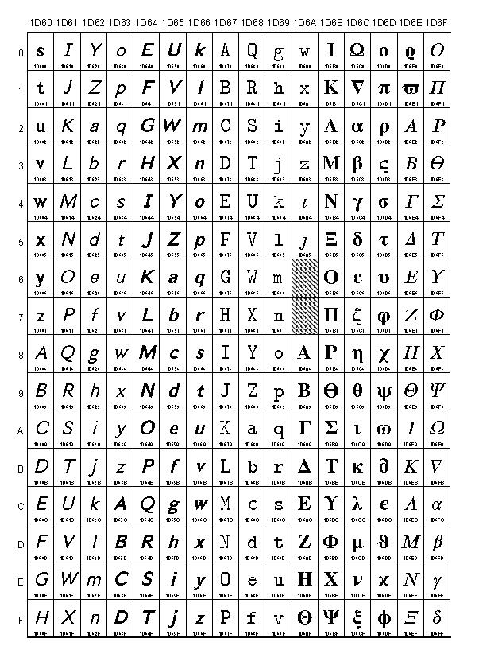

# 微信发送斜体加粗文字
微信发送倾斜加黑的字体，利用 unicode 字符的转换。

应用了 [Mathematical Alphanumeric Symbols](https://www.unicode.org/charts/PDF/U1D400.pdf) ，对应的码点值是 U+1D63C - U+1D6A3，包含大写字母和小写字母。

在线体验地址：[text.windlaing.wang](http://text.windliang.wang)。

微信小程序**神奇字体**已发布，支持更多字体选择。

